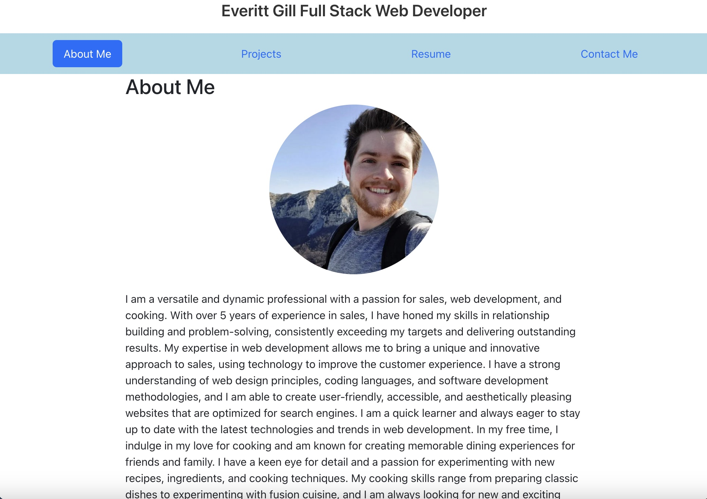

# <Everitt-Gill-Portfolio>

## Description

This is a portfolio of my work built using React. It contains 6 projects, a method to contact me, and a brief bio.

- I was motivated to build this because I needed a portfolio to show employers
- This portfolio which will be updated periodically will be given to employers
- From making this I learned about props, components, and conditionally rendering pages in React

## Installation

There's nothing to install, just follow this link
https://everittgill.github.io/Everitt-Gill-React-Portfolio/
## Usage

Provide instructions and examples for use. Include screenshots as needed.

To add a screenshot, create an `assets/images` folder in your repository and upload your screenshot to it. Then, using the relative filepath, add it to your README using the following syntax:

    

    

## Credits

Developer- Everitt Gill

Github- https://github.com/EverittGill

Tutorials followed- GA Tech fullstack development bootcamp resources and classes

this tutorial for one of my components
https://codepen.io/angeladelise/pen/MWjExGN

## License

MIT license

## Features

Built using React
